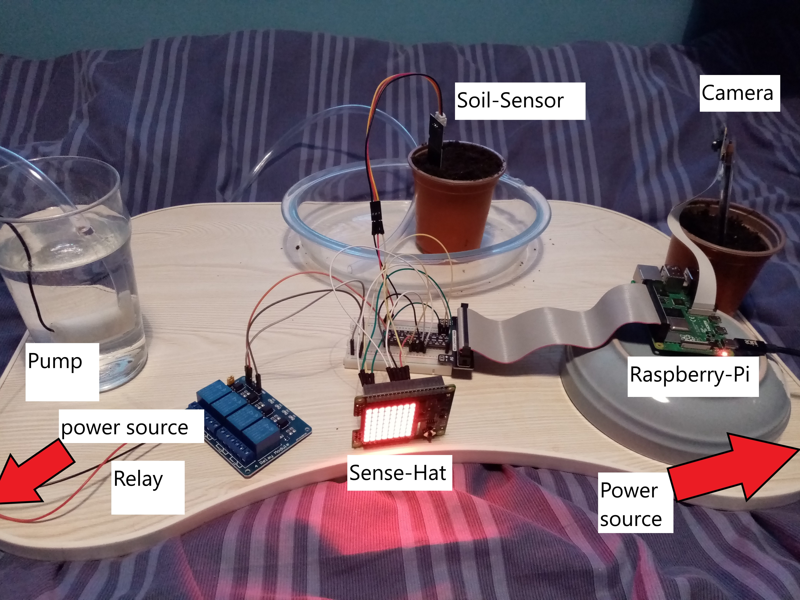
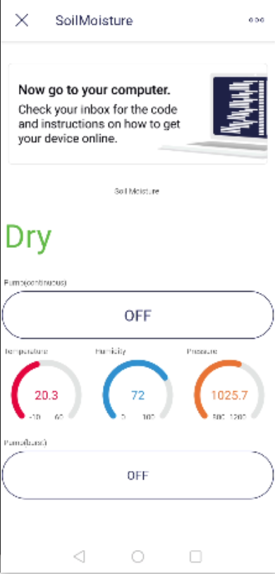

Welcome to my soil-moisture-project
===================================

youtube demo = https://youtu.be/gaJR-BDELMc

website = https://soil-moisture-project.glitch.me/

The project collects temperature, humidity, pressure and soil moisture data from sensors on the raspberry pi and
a soil moisture sensor. Data is sent to thingspeak IOT via MQTT. To get the data collected from thingspeak to 
my website, http protocol is used. The soil moisture sensor used is analog and only measures wet of dry.
If I had more time I could use a analog digital converter to get more precise readings of the soil moisture.
Thingspeak graphs are also embeded on the website. There is a live stream of the plant. When the soil moisture
becomes dry an email is sent to the user and the pump is activated by the relay and pumps water to the plant.
I also created a blynk app. The app has 2 buttons. One gives a continous stream of water the other gives short
bursts. The temp, hum, pressure and soil moisture readings are displayed.

What was needed:
- Pump
- Water Source
- Hose
- Relay
- Power supply x2
- Sense-Hat
- Raspberry pi
- Camera
- Pot and soil
- Soil sensor
- Tray

Languages and others:
- Javascript
- Python
- Handlebars
- Glitch
- Thingspeak
- IFTTT
- Webhooks
- Blynk

Soil-moisture-project website
==============================

The website displays the most recent temperature, humidity and pressure readings. 
The moisture of the soil is displayed as wet or dry.
Temperature is also displayed in fahrenheit.

The five most recent readings and its timestamp are displayed in a table.
A graph for each datastream is embed on the website to dispay the data.
The value of -2 indicates dry and 2 indicates wet.

The user will have to enter their own thingspeak api key and channel id.
This can be put in the .env file.

The user will also have to put in their own streaming website. This can also be done in the 
.env file.

Deployed: https://soil-moisture-project.glitch.me/

Setting up thingspeak
==============================

1. Create Thingspeak account - www.thingspeak.com - Get started for free.
2. Fill out details and continue.
3. After successful registration, log into thingspeak account.
4. Create a new channel - soil-moisture-project.
5. Create 4 fields - Temperature, Humidity, Pressure and Soil Moisture.
6. Save channel at the bottom of page.
7. You will know be brought to a page where the API keys and channel id are located.
8. Copy these values to the .env file.

Setting up thingspeak to send email when soil is dry
==============================

1. Create an IFTT account - www.iftt.com
2. Log on - Go to home page and click create and the "add"
3. Select webhooks service - Enter webhooks in search field - select webhooks card.
4. After you select webhooks as the trigger - Click "Receive a web request".
5. Enter event name - Plant is dry
6. To selecting the resulting action click on "add" in the then that card.
7. Enter email into search bar - click notifications box - Then select "Send me an email".
8. Enter your email address.
9. Follow the instructions.
10. Update the subject and body of the event email.
11. Click continue and the finished. You are now connected to the ifttt service.
12. Get the trigger URL - click on the user icon top left corner - Click services.
13. Scroll down to webhooks - Click documentation icon. 
14. Open your soil-moisture-project channel in ThingSpeak.
15. Choose Apps => ThingHTTP, and select New ThingHTTP.
16. Edit your ThingHTTP settings.
17. Name - Name your ThingHTP.
18. URL - Enter the URL from the Webhooks documentation. The URL for this example has the 
form https://maker.ifttt.com/triigger/EVENT/with/key/xxxxxxxxxxxxxxxxxxxxxx.
19. Method - Enter GET.
20. Create a React app to trigger the ThingHTTP based on your channel data
21. In Thingspeak in your channel, choose Apps > React, and then click New React 
22. Name - temp email react
23. Condition type - Numeric
24. Test frequency - On data insertion.
24. Channel - soil-moisture-project.
25. Condition - Field 4 equals -2(dry)
26. ThingHTTP - IFTT Request
27. Once the soil moisture in the channel reaches the set point for your React, 
you'll receive an email. It will only happen the first time the condition is met.

Setting up the live stream
==============================

1. In the mjpegstreamerexperimental folder.
2. Run the following code: mjpg_streamer -i input_uvc.so -o output_http.so
3. To stream the video to the internet.
4. Create an ngrok account.
5. Go to https://dashboard.ngrok.com/signup and follow the instructions to sign up.
6. Open a second command line window on the Rasperry 
Pi (leave the streaming service running in the other window).
7. On your Raspberry Pi, create a folder called ngrok
8. On the second command line window on the Rasperry Pi, navigate to the ngrok folder,
download the ngrok archive using wget and unzip as follows:
wget https://bin.equinox.io/c/4VmDzA7iaHb/ngrok-stable-linux-arm.zip
unzip ngrok-stable-linux-arm.zip
9. Use ngrok to add your authtoken to your ngrok.yml file.
10. Your Streaming Server is currently listening on port 8080. The following command will 
start forwarding http on your local port 8080: ./ngrok http 8080
11. Copy one of the URLs into the DB_STREAM_WEBSITE variable in the .env file.

I have created 4 scripts for my project.
1. blynk.py
2. pump.py
3. soilMoisture.py
4. Thinkspeak-pub.py

thinkspeak-pub.py
=======================================

The thingspeak platform allows me to update and receive updates from the channel feeds via the thingspeak mqtt broker. Mqtt is a publish/subscribe communication protocol that uses TCP/IP sockets or websockets.

Create an MQTT device for your Raspberry Pi as follows:
1. In the ThingSpeak menu click Devices > MQTT
2. On the MQTT Devices page, click Add Device > Add a new device
3. Fill in the Add a new device dialog as follows
4. Enter Name and Description. In Authorize Channels to access, select "soil-moisture-project" and click "Add Channel" followed by "Add Device"
5. ThingSpeak will now generates a list of credentials for your device that includes client ID, username, and password.
6. Click Download Credentials, select the Plain Text option, and save the credentials in a local file. Important: Record or save your credentials now, as you will not get another opportunity to view or save the password.
7. Click Done to complete the device creation.
8. Create .env file with configuration data
9. Copy the contents of the Plain Text credentials file into .env.
10. Finally, add the soil-moisture-project channel ID and transmissionInterval to the .env file. You can get the soil-moisture-project channel ID from the Channels tab in Thingspeak(found in the website README).

blynk.py
=====================================

I created a blynk app for my project.
There are two buttons:
 1. Releases a continous stream of water until the button is pressed again.
 2. Realeases the water in short bursts.

The app displays the state of the soil. Dry or Wet.
There a three gauges at the bottom of the app that display the 
temperature, humidity and pressure values.

How to set up blynk app:
1. Go to the Blynk Web Site and click the "Start Free" button - www.blynk.cloud
2. Follow the instructions to create your account.
3. Create a new device.
4. Go to the "MY Devices" option and click "New Device" 
5. Choose the "From Template" option. Select "Quickstart Template " and enter "SoilMoisture" as the Device Name.
6. Click "Create" and you should see the default Dashboard for your Device.
7. Place your blynk auth code from when you created your device, into your .env file.

pump.py
=======================================

When the soil sensor is dry it pumps the water into the plant.
The water is pumped in short bursts. The length of time between 
the pumps can be changed and the length of bursts can also 
be changed.

